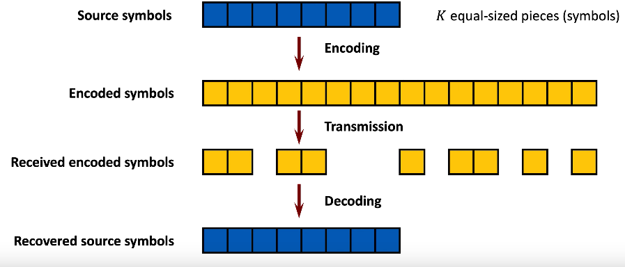
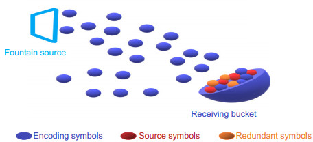
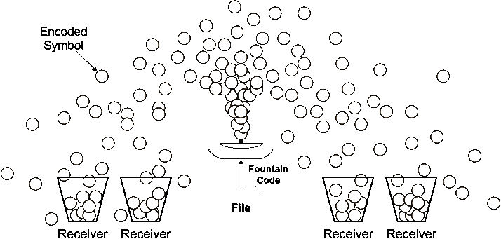
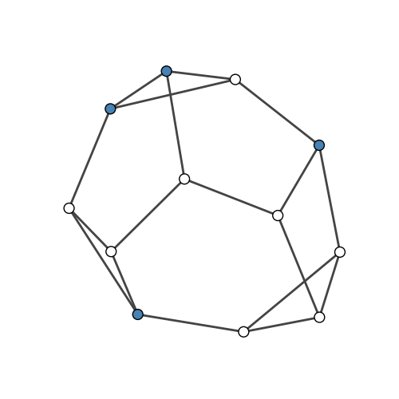

# Introduction {.s}

**Today's paper:**

*Data Persistence in Large-scale Sensor Networks with Decentralized Fountain Codes* [^0]

[^0]: [@lin2007data]

## Overview

- Luby Transform (LT) code [^1]
- Network of nodes, sensors, sinks
- Unreliable nodes
- Unavailable sinks

[^1]: [@luby2002lt]

## Fountain Codes (why)

What problem does a fountain code solve? Recovering erasures!

## Fountain Codes (how)

How does a fountain code recovering erasures? Redundancy!

{ height=600px }

## Fountain Codes (who)

Who does a fountian code send messages to? Many neighbors!

{ height=600px }

# Sensor Networks

## Sensor Networks (concept)

:::::::::::::: {.columns align=center}

::: {.column width="60%"}
What is the idea of a sensor "Sensor Network?"

- Many "geographically" connected nodes
- Blue "sensor" sources
- Red "receiver" sinks
- White "cache" nodes

::::

::: {.column width="40%"}

::::

::::::::::::::

## Sensor Networks (scale)

:::::::::::::: {.columns align=center}

::: {.column width="60%"}
What is the scale of a sensor "Sensor Network?"

- $N > 10^4$ nodes 
- $K > 10^3$ sources
- $1$ or more sinks
- $N - K$ "cache" nodes

::::

::: {.column width="40%"}

::::

::::::::::::::

## Sensor Networks (difference)

:::::::::::::: {.columns align=center}

::: {.column width="60%"}
What is **not** of a sensor "Sensor Network?"

- Fixed topology
- Centralized routing
- Solve using *max-flow*
- "Push-based" data flow

::::

::: {.column width="40%"}

::::

::::::::::::::

## Sensor Networks (sinks)

:::::::::::::: {.columns align=center}

::: {.column width="60%"}
What are sinks in a sensor "Sensor Network?"

- Sinks are not persistent in the network
- Sinks transit through the network
- "Pull-based" data flow

::::

::: {.column width="40%"}

::::

::::::::::::::

## Sensor Networks (topology)

:::::::::::::: {.columns align=center}

::: {.column width="60%"}
What is network topology in a sensor "Sensor Network?"

- Nodes may permanently fail
- Topology changes, monotonically decreasing vertices/edges

::::

::: {.column width="40%"}

::::

::::::::::::::

## Motivating Example (Science)

:::::::::::::: {.columns align=center}

::: {.column width="60%"}
Example: Scientific sensor network

- Deploy many sensors collecting scientific data
- Difficult to access sensors after deployment
- Nodes damaged by flora, fauna, or weather
- Collect data via expensive collector vehicle
- Reliably recover as much data as possible

::::

::: {.column width="40%"}

::::

::::::::::::::

## Motivating Example (Warfare)

:::::::::::::: {.columns align=center}

::: {.column width="60%"}
Example: Battlefield sensor network

- Battlefield sensors collecting inelligence
- Enemy has abundance of artillery
- Enamy shells portion of battlefield
- Carfully retrieve data from surviving nodes
- Reliably recover as much data as possible

::::

::: {.column width="40%"}

::::

::::::::::::::

## Desiderata

Sensor network features

- Decenteralized routing
- Dynamic, decreasing topology
- Pull-based polls of vertex subsets
- Reliable data recovery from polling

# Data Persistence

## Data Persistence

- Lots of erasures in network
- Fountain codes handle erasures well
- Construct specialized LT code

## Data Persistence (RAID lessons)

Sensor network as persistent storage

- View network as analogous to RAID device
- RAID used to recover data after disk failures
- RAID-6 already uses coding theory (Solomon codes)
- Hint that coding theory is the right approach

## Data Persistence (Soliton Distribution)

:::::::::::::: {.columns align=center}

::: {.column width="45%"}
{ height=175px }

{ height=115px }
::::

::: {.column width="55%"}

::::

::::::::::::::

## Data Persistence (Broadcasts)

:::::::::::::: {.columns align=center}

::: {.column width="60%"}
Random walks

- Encoded blocks broadcasted into network
- Encoded blocks have appended source ID
- Routing follows a random walk
- Each receiving node caches encoded blocks
- Walk length depends on network size

::::

::: {.column width="40%"}

::::

::::::::::::::

## Data Persistence (Markov properties)

:::::::::::::: {.columns align=center}

::: {.column width="60%"}
Markov chains

- Time-reversible Markov chain
- Ergodic & suffciently long walk
- Steady-state distribution equals limiting distribution
::::

::: {.column width="40%"}

::::

::::::::::::::

## Data Persistence (Walk length)

:::::::::::::: {.columns align=center}

::: {.column width="60%"}
Minimize walk length

- Long walk, high network overhead 
- Minimize walk length
- Preserve steady-state distribution convergence
- Use Metropolis algorithm [^2]
::::

::: {.column width="40%"}

::::

::::::::::::::

[^2]: [@upfal2005probability]

## Data Persistence (Random Transition)

:::::::::::::: {.columns align=center}

::: {.column width="43%"}
Compute transition matrix

- Use Metropolis algorithm
- Use steady state distribution
- Each row needs local information
- Table construction is distributed
::::

::: {.column width="57%"}
{ height=50px }

{ height=600px }
::::

::::::::::::::

## Data Persistence (Routing)

Probabilistic Forwarding Table

- Each transition matrix row corresponds to a node
- Each row element is probability of forwarding data
- Use the row $i$ of transition matrix

## Data Persistence (Result)

:::::::::::::: {.columns align=center}

::: {.column width="60%"}
Resulting combination

- Sources broadcast encoded blocks
- Every node forwards blocks probabilistically
- Random walk length expectation minimized
- Sink transits network, polling for blocks
- Accumulate enough blocks to recover message
::::

::: {.column width="40%"}

::::

::::::::::::::

## Data Persistence (Other)

:::::::::::::: {.columns align=center}

::: {.column width="60%"}
Other considerations

- Multiple-random walks for redundancy
- Repeat encoded block broadcasts for redundancy
::::

::: {.column width="40%"}

::::

::::::::::::::

# Algorithm {.s}

## Algorithm

Each node *independently*:

1. Degree generation
2. Compute steady-state distribution
3. Compute probabilistic forwarding table
4. Compute the number of random walks
5. Block dissemination
6. Encoding & routing
7. GOTO \[5\]

## Algorithm

Each node *independently*:

1. Chooses its code-degree $d$ from the Robust Soliton distribution
2. Computes its steady-state distribution $\pi_{d}$ from its chosen code-degree $d$
3. Computes probabilistic forwarding table $T_{d}$ by the Metropolis algorithm using $\pi_{d}$
4. If sensor; computes $b$, the number of random walks from itself
5. If sensor; disseminates $b$ copies of its source block with its node $ID$ using $T_{d}$
6. Encoded block by (XOR) a subset of $d$ received blocks and forward using $T_{d}$
7. GOTO \[5\]

## Algorithm 

- Decod using Belief Propagation algorithm
- Similar to LT codes

# Results

## Theory

:::::::::::::: {.columns align=center}

::: {.column width="60%"}
$$\mathcal{O}(\ln(K/\delta))$$
Average degree of an encoded block
::::

::: {.column width="40%"}
{ height=150px }
::::

::::::::::::::

## Practice

:::::::::::::: {.columns align=center}

::: {.column width="60%"}
As walk length increases converges to other codes
::::

::: {.column width="40%"}
{ height=600px }
::::

::::::::::::::

# Conclusion

- Treat sensor network as storage device

- Use coding theory and probability theory to define fountain code

- Have sink poll subset of network

- Robust erasure recovery in network with frequent faults

## Conclusion

:::::::::::::: {.columns align=top}
::: {.column width="50%"}
\
**Thank you!**
\
\
\
\
\
\
Slides are publicly available [^3]
::::

::: {.column width="50%"}
\
**Questions?**
::::
::::::::::::::

[^3]: [https://github.com/recursion-ninja/CSc-85020/tree/master/Presentation](https://github.com/recursion-ninja/CSc-85020/tree/master/Presentation)

## References {.allowframebreaks}